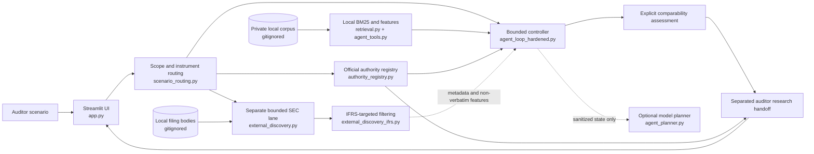

# IFRS 9 Auditor Research Assistant — Evidence-grounded RAG prototype

An auditor starting with an unfamiliar client transaction needs to find possible comparable disclosures without confusing company reporting practice with authoritative IFRS requirements.

This is a small offline-first Streamlit research workflow with an optional model planner. It is not an accounting decision system and does not approve audit work. The private annual-report corpus remains gitignored and local; it is not redistributed or sent to a model. Without an OpenRouter key, the application truthfully labels and runs a deterministic fallback workflow rather than simulating model activity.

The primary persona is an auditor or accounting researcher who knows the client fact pattern but may not know a comparable issuer in advance. The input is a narrative audit scenario plus optional local/private data. The output is a scope-aware, authority-first research handoff with source provenance, explicit comparator dimensions, evidence gaps and a mandatory human-review boundary.

Current submission documentation:

- [Product documentation](docs/current_release/PRODUCT.md) — Persona, Input, Output, Architecture, Target Metrics and Achieved Metrics.
- [Architecture and module map](docs/current_release/ARCHITECTURE_AND_MODULES.md) — file-level/module-level responsibilities and evidence boundaries.
- [Data and evaluation guide](docs/current_release/DATA_AND_EVALUATIONS.md) — frozen retrieval bank, source mappings, QA, scenario evaluation and reproduction.
- [Submission readiness](docs/current_release/SUBMISSION_READINESS.md) — instructor requirements, public-safe inventory and remaining deliverables.

## What the prototype demonstrates

- A scenario form fixed to IFRS Accounting Standards as issued by IASB for the initial filter.
- Visually separate official IFRS authority cards, IFRS Foundation supporting/educational material, professional-interpretation gaps, company disclosures, and limitations.
- Candidate status (`candidate only` versus `indexed and inspected`) and framework status (`confirmed`, `pending`, or `excluded`).
- Dependency-free local BM25 retrieval.
- Conservative scenario routing that distinguishes development loans, banking loans, trade receivables, debt investments, lease receivables, guarantees/commitments and unsupported accounting scopes.
- Explicit read-only research tools with controller-enforced legal transitions, six-step local and ten-step external caps, duplicate-call blocking, bounded result counts, safe errors, early stopping, and actual traces.
- Optional OpenRouter model planning over structured scenario state and metadata only; local BM25 and source-body processing stay in-process.
- Explicit comparability ratings (`strong`, `partial`, `weak`, or `insufficient`) across business model, instrument, borrower/counterparty, collateral, construction/leasing, and ECL treatment.
- An outbound-content gate that accepts only project-authored cards that are both source-verified and approved for external API use.
- Local abstention when approved generation context is unavailable.
- Display-only historical metrics and five separate development/demo scenarios.

## Current architecture



Raw annual-report chunks, downloaded filing bodies and IFRS source text remain local. The optional planner receives only the scenario, tool contracts, structured state, metadata, ranks/scores, authority labels and locally derived non-verbatim features.

## Data status

Gate 1 found the workspace empty. Gate 3 subsequently integrated the supplied private runtime bundle beneath the gitignored `private_data/` tree. Gate 4 adds bounded planning without altering the corpus or frozen evaluation artifacts. See [the public-safe Gate 1 audit](docs/current_release/GATE1_AUDIT_PUBLIC.md), [the Gate 3 integration audit](docs/GATE3_PRIVATE_INTEGRATION_v01.md), and [the Gate 4 architecture note](docs/GATE4_ARCHITECTURE_v01.md).

Gate 4.5 ran three live `openai/gpt-4o-mini` planner cases through OpenRouter. Privacy and controller guardrails held, but the two comparator cases did not reach the comparability tool; that validation remains preserved as a partial failure. Gate 4.6 then hardened the workflow as an explicit state machine with state-specific tool menus, controller-owned candidate scope, mandatory comparability and authority checks, and one-time structured evidence gaps. Its three fresh live cases completed the intended workflows without fallback.

Gate 5 adds a separate, bounded SEC EDGAR discovery lane so the scenario does not have to name a comparator. Official full-text search and submissions metadata lead to at most three candidates; filing bodies are downloaded only to gitignored `external_runtime/`, verified and searched locally, and represented to the planner only by structured metadata, hashes, feature counts, and locators. The first live flagship run discovered three external candidates and retained Toll Brothers as a limited economic comparator while preserving Allied_REIT as the stronger separate local comparator.

Gate 5.1 adds `required_reporting_framework = IFRS` discovery. It searches Form 20-F filings but requires issuer-specific basis/auditor evidence before classifying a candidate as IFRS, then applies business classification before deep property comparability. Its single live run verified three IASB-IFRS issuers and retained Logistic Properties of the Americas as a partial comparator. Allied_REIT remains pending because its available frozen extracts do not establish the exact reporting basis.

Gate 6 integrates the local workflow and sanitized recorded Gate 5.1 evidence into one auditor-facing Streamlit journey. Displaying the recorded external result does not rerun SEC discovery. The UI preserves the post-live Shinhan integrity finding: SIC-based hardening was regression-tested offline, the original live checkpoint was not overwritten, and no second live external-discovery run occurred.

Gate 6.1 adds a deliberately small `IFRS Authority Registry` for the flagship ECL scenario. It stores only official-source metadata, verified paragraph references where available, and concise non-verbatim summaries. The authority lookup precedes comparable-company research in the UI. No IFRS source body is stored, redistributed, or sent to OpenRouter, and no new SEC discovery was performed.

The post-Gate-6.1 hardening adds scope-aware routing and scenario-specific comparability controls after the frozen eight-scenario evaluation exposed over-broad routing, generic-ECL matching and cross-scenario presentation leakage. Unsupported scopes now stop cleanly; instrument-specific authority gaps cause abstention; and a historical flagship snapshot is no longer attached to unrelated current handoffs. The original v1/v1.1 observations remain frozen, while S01–S08 post-fix observations are stored separately as regression diagnostics rather than unseen-holdout performance.

The public fixture remains self-authored test material labelled `PROJECT_EDUCATIONAL_NOTE`. When private mode is enabled, the app uses the actual 76 local annual-report chunks instead of the synthetic retrieval fixture. Those private chunks remain gitignored and are never included in trace downloads or model payloads.

The raw transferred-file SHA-256 is `105eef…`, while the historical freeze manifest records the canonical parsed-JSON content hash `551060…`. The audit now computes and labels both methods; the canonical hash reproduces the manifest exactly. All five manifest-referenced frozen files, including the separately supplied label-audit CSV, are installed locally and match their recorded byte hashes.

## Run the public demo

Python 3.11 or newer is recommended.

```powershell
python -m venv .venv
.\.venv\Scripts\python -m pip install -r requirements.txt
.\.venv\Scripts\python -m streamlit run app.py
```

No API key and no private corpus are needed. With no key, the public demo uses the labelled deterministic fallback and makes no network or model call.

To enable the optional model planner, set `OPENROUTER_API_KEY` at runtime. `OPENROUTER_MODEL` and `OPENROUTER_BASE_URL` are optional. The key must not be committed. Model calls receive the scenario, tool contracts, structured state, source identifiers, provenance metadata, ranks, scores, and locally derived non-verbatim feature counts; they do not receive annual-report chunk text.

## Optional private corpus (local only)

Supply an absolute local path in the sidebar. The JSON must be a list of records containing:

`chunk_id`, `source_type`, `authority_level`, `company`, `year`, `pdf_page`, `topic`, and `text`. `source_id` is retained when supplied but is not invented when absent.

The loader requires 76 unique chunk IDs, opens the file read-only, and compares its SHA-256 before and after loading. Raw chunks are used only for local retrieval and preview; they never enter the outbound-card payload or downloadable trace. The supplied corpus omits `source_id` on 48 records, so the app preserves that absence and uses `chunk_id` plus page metadata instead of fabricating IDs.

## Run tests

Use the version-aware offline release runner:

```powershell
& '.\.venv\Scripts\python.exe' evaluations/post_hardening_release_v1/run_release_verification.py
```

Latest verification: 127 current-version tests passed with zero failures, errors or skips; all 88 protected immutable artifacts matched. The runner also executes four unchanged historical-snapshot tests separately. Those four retain the expected `Integrity mismatch: app.py` errors because the original v1/v1.1 manifests validate the pre-hardening application source. They are not deleted, skipped or weakened.

The transparent raw suite therefore reports 127 passed and four historical-snapshot errors:

```powershell
& '.\.venv\Scripts\python.exe' evaluations/scenario_hardening_postfix_v1/run_all_tests_offline.py
```

Run the focused routing/UI regression and the public-release audit:

```powershell
& '.\.venv\Scripts\python.exe' -m unittest tests.test_scenario_hardening_postfix tests.test_streamlit_app -v
& '.\.venv\Scripts\python.exe' -m src.release_audit
```

The focused suite currently has 20 passing tests. All commands above are offline; the release runner clears provider credentials and blocks sockets and URL opening.

## Historical results and generation pilot

With private mode enabled, the app reads the supplied `holdout_summary_v02.csv` without recomputation: 76 chunks; 12 development questions; 38 holdout questions; BM25 Hit@1 71.1% (27/38), Hit@5 97.4% (37/38); Semantic Hit@1 34.2% (13/38), Hit@5 73.7% (28/38). These are historical fixed-corpus baseline results, not new workflow or agent results. Public-fixture mode displays the same values from the separately labelled project metadata file.

The [public-safe benchmark export](evaluations/public_retrieval_benchmark_v1/README.md) provides all 50 frozen question texts and all 58 accepted evidence mappings without annual-report passages. Exact metric reproduction still requires the private 76-chunk corpus because the export contains identifiers and provenance, not retrievable source bodies.

The earlier educational-note pilot reportedly used `openai/gpt-4o-mini` via OpenRouter (311 input tokens, 149 output tokens, US$0.00013605 for one call) and recorded 4/4 grounding against project-authored notes. Its prompts, sentences, evidence cards, and review artifacts were not present, so this project does not reproduce or re-sign that result. The grounding review CSV remains empty pending actual source material and independent human review.

## Authority and generation policy

Gate 6.1 distinguishes `IFRS_STANDARD_OFFICIAL_AUTHORITY`, `IFRS_FOUNDATION_SUPPORTING_OR_EDUCATIONAL`, `PROFESSIONAL_COMMENTARY`, `COMPANY_DISCLOSURE`, and non-authoritative `PROJECT_EDUCATIONAL_NOTE`. Seven structured cards cover the official IFRS 9 page, ECL recognition scope, 12-month versus lifetime ECL, significant increases in credit risk, ECL measurement and forward-looking information, IASB educational material, and collateral/credit enhancements. Exact references were verified for paragraphs 5.5.1, 5.5.3, 5.5.5, 5.5.9, 5.5.17, and B5.5.55; other references remain explicitly `pending`.

The registry does not contain IFRS Standard text. Supporting or educational material is never labelled as Standard text, professional interpretation remains unavailable, and planner-safe authority payloads contain only the structured non-verbatim fields in the registry.

A company disclosure can support a statement about what that issuer reported. It cannot, by itself, support a general claim about what IFRS requires. Every factual generated sentence must cite a retrieved chunk ID. No card in this build passes the generation gate, so the draft correctly abstains.

## Fixed RAG versus bounded agentic workflow

The historical fixed RAG offers fast, repeatable retrieval over a known 76-chunk collection. Gate 4 adds a planner-controller loop for scenario intake, candidate inspection, explicit comparability, authority separation, evidence requests, and safe stopping. When an OpenRouter key is available, a model chooses among the same controller-governed tools. When it is absent, the deterministic fallback follows a fixed policy and reports zero model tokens and zero provider cost. This build makes no claim of numerical superiority over the frozen baseline.

## Project artifacts

- `docs/current_release/PRODUCT.md` — current Persona/Input/Output/Architecture/metrics documentation.
- `docs/current_release/ARCHITECTURE_AND_MODULES.md` — Mermaid flow, module map, boundaries and test ownership.
- `docs/current_release/DATA_AND_EVALUATIONS.md` — 50-question bank structure, source mappings, QA, metrics and scenario evaluation.
- `docs/current_release/SUBMISSION_READINESS.md` — instructor-requirement checklist, safe-publication boundary and missing deliverables.
- `evaluations/post_hardening_release_v1/` — version-aware release manifest, verifier and historical-snapshot explanation.
- `evaluations/scenario_hardening_postfix_v1/` — separate S01–S08 post-fix observations and regression evidence.
- `evaluations/public_retrieval_benchmark_v1/` — public-safe 50-question export, flat accepted-mapping table, schema, integrity report and derivative manifest.
- `docs/current_release/GATE1_AUDIT_PUBLIC.md` — path-sanitized Gate 1 workspace/file matrix; the protected path-bearing original is excluded from the public repository.
- `docs/GATE3_PRIVATE_INTEGRATION_v01.md` — private corpus, manifest, and retrieval audit.
- `docs/GATE4_ARCHITECTURE_v01.md` — Gate 4 planner/controller and data-boundary design.
- `docs/GATE4_FLAGSHIP_TRACE_v01.json` — metadata-only acceptance trace from the local fallback run.
- `docs/TEST_RESULTS_GATE4_v01.md` — Gate 4 and full-suite verification evidence.
- `docs/GATE45_LIVE_PLANNER_AUDIT_v01.json` — sanitized live planner request/response metadata and outcomes.
- `docs/GATE45_LIVE_PLANNER_RESULTS_v01.md` — Gate 4.5 acceptance assessment and provider-reported usage.
- `docs/GATE46_LIVE_REVALIDATION_ATTEMPT1_v01.json` — preserved first Gate 4.6 attempt that exposed incomplete candidate scope.
- `docs/GATE46_LIVE_PLANNER_AUDIT_v01.json` — sanitized successful Gate 4.6 live request/response metadata and outcomes.
- `docs/GATE46_HARDENING_RESULTS_v01.md` — Gate 4.6 controller design, live results, usage, and verification.
- `docs/GATE5_LIVE_DISCOVERY_AUDIT_v01.json` — sanitized ten-step SEC discovery trace, sources, framework checks, evidence locators, and usage.
- `docs/GATE5_RESULTS_v01.md` — Gate 5 architecture, live evaluation, privacy boundary, and limitations.
- `docs/GATE51_LIVE_DISCOVERY_AUDIT_v01.json` — sanitized Gate 5.1 trace, candidate decisions, framework evidence metadata, efficiency, and preserved live-integrity finding.
- `docs/GATE51_RESULTS_v01.md` — Gate 5.1 IFRS-targeted outcome, post-live hardening, tests, and limitations.
- `data/public_demo/gate4_scenario_eval_v01.json` — five separate Gate 4 development/control cases, not a frozen holdout.
- `docs/GENERATION_GROUNDING_REVIEW_v01.csv` — source-to-sentence review template with independent human review pending.
- `docs/DEMO_SCRIPT_v01.md` — successful and abstention walkthrough.
- `docs/QUALITATIVE_COMPARISON_GATE4_v01.md` — fixed RAG versus Gate 4 bounded-workflow comparison.
- `docs/REPORT_SKELETON_v01.md` — report outline and required caveats.
- `docs/TEST_RESULTS_v01.md` — preserved pre-Gate-3 public-prototype test evidence.
- `docs/TEST_RESULTS_GATE3_v01.md` — full private-path Gate 3 verification evidence.
- `data/public_demo/final_submission_snapshot_v01.json` — public-safe recorded flagship synthesis and actual cost metadata.
- `docs/final_submission/` — final report, architecture, trade-off, evaluation, responsible-AI, demo, cost, and self-appraisal drafts.
- `docs/final_submission/HISTORICAL_ARTIFACT_HASHES_v01.json` — Gate 6 preservation ledger for Gate 4 through Gate 5.1 evidence.
- `data/public_demo/ifrs_authority_registry_v01.json` — seven structured, non-verbatim official-source authority cards.
- `docs/GATE61_AUTHORITY_LAYER_v01.md` — sources, verified references, privacy boundary, tests, and remaining questions.

## Final public-repository boundary

The public package must exclude API keys, the identifying SEC User-Agent value, private corpus files, full downloaded filings, `.env` files, runtime caches, and copyrighted annual-report text. Public-safe schemas, source code, tests, hashes, synthetic fixtures, sanitized traces, and small non-verbatim derived metadata may remain. The release audit evaluates the release-eligible filesystem tree after excluding ignored runtime roots and checks exact configured secret values when available.

This workspace has no Git metadata, so the current release cannot claim to have inspected a Git index or remote. Before publication, initialise or inspect the intended repository, verify the staged file list, and enable the hosting platform's secret scanner.

The final approximately 1,200-word report and approximately five-minute face-and-screen demo video are not included yet. The video must remain within the announced eight-minute maximum. This documentation task does not create, commit, push or publish a repository.

## Final known limitations

- Gate 6.1 provides narrow official IFRS 9 authority-card coverage only; it is not a complete IFRS library and professional interpretation remains absent.
- Allied_REIT's exact reporting framework remains pending.
- Logistic Properties is a partial comparator and does not establish development-partner financing.
- Bounded SEC discovery and phrase-pattern framework verification may miss relevant issuers or uncommon formulations.
- Gate 5.1 post-live SIC hardening was not subjected to a second live external-discovery run.
- Provider-reported API cost is not total cost-to-serve and excludes engineering, infrastructure, governance, source licensing, and human review.
- Every output requires independent auditor review.

## AI assistance and human review

Codex implemented and automatically tested this prototype from the supplied brief. Candidate relevance, source licensing, reporting-framework confirmation, accounting interpretation, and final audit conclusions require independent human review. Automated or assistant review is not an auditor signature.
