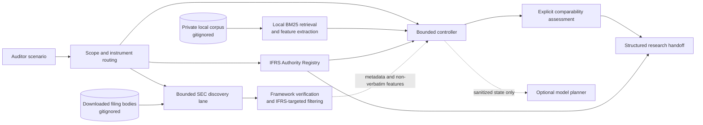

# IFRS 9 Auditor Research Assistant — Evidence-grounded RAG prototype

## Project overview

The primary user is an auditor or accounting researcher who has a client fact pattern but may not know a relevant comparable issuer. The problem is not simply finding documents: the user must distinguish authoritative IFRS material from company reporting practice, identify economically relevant comparators, preserve provenance, and surface evidence gaps before exercising professional judgement.

This Streamlit prototype uses an authority-first, evidence-grounded workflow. It routes a narrative audit scenario by accounting scope and instrument, retrieves structured official-source authority cards, searches a local corpus with BM25, and assesses comparable-company disclosures across explicit business and exposure dimensions. A bounded controller governs every research action. An optional model planner may choose from the controller's permitted tools, but raw annual-report, filing, and IFRS source text stays local.

The output is a structured research handoff—not an accounting conclusion—with separate sections for official IFRS sources, comparable-company practice, evidence gaps, provenance, and required auditor review.

## Workflow overview

```text
User audit scenario
→ Scope routing
→ Authority and evidence filtering
→ Retrieval and comparator discovery
→ Structured research handoff
```

## Product at a glance

| Requirement | Current implementation |
| --- | --- |
| **Persona** | External auditor or accounting researcher starting from a client fact pattern rather than a known comparator. |
| **Input** | Narrative audit scenario, IASB-IFRS framework preference, and optional gitignored 76-chunk local corpus. Separately authorised experiments may use runtime OpenRouter or SEC credentials. |
| **Output** | Scope-aware research topics, official authority cards, retrieved evidence with provenance, explicit comparator dimensions, framework status, evidence gaps, safe abstentions, and a human-review handoff. |
| **Architecture** | Offline-first Streamlit UI, scenario router, authority registry, local BM25 retrieval, bounded controller, optional sanitized model planner, and a separate bounded SEC discovery lane. |
| **Target metrics** | Track Hit@1/Hit@5 on the frozen holdout; preserve corpus integrity; enforce authority separation, privacy, bounded agency, scenario safety, and passing current-release regression tests. No undocumented numerical target was added retrospectively. |
| **Achieved metrics** | Historical holdout: BM25 Hit@1 71.1%, Hit@5 97.4%; semantic Hit@1 34.2%, Hit@5 73.7%. Final-evidence release regression: 137/137 tests passed and 88/88 protected artifacts matched; the prior published release recorded 127/127. These measure different evaluation layers and are not combined into one score. |

Detailed Persona, Input, Output, Architecture, Target Metrics, and Achieved Metrics are in [Product documentation](docs/current_release/PRODUCT.md).

## High-level architecture



The controller enforces legal state transitions, controller-owned candidate scope, duplicate-call blocking, bounded result counts, safe stopping, a six-step local cap, and a ten-step external cap. SEC discovery targets explicit filing and metadata endpoints; it is not unrestricted browsing. The optional planner receives only the scenario, tool contracts, structured state, provenance metadata, ranks/scores, authority labels, and locally derived non-verbatim features.

See [Architecture and module map](docs/current_release/ARCHITECTURE_AND_MODULES.md) for source-file responsibilities, state transitions, and test ownership.

## Evidence and authority boundaries

The UI keeps official IFRS authority, IFRS Foundation supporting or educational material, professional interpretation, company disclosure, and project-authored educational material distinct. A company disclosure may establish what an issuer reported; it cannot establish what IFRS requires. Supporting or educational material is not labelled as IFRS Standard text, and missing paragraph references are not invented.

The deliberately small IFRS Authority Registry contains seven structured, non-verbatim official-source cards for the flagship ECL workflow. Verified references include IFRS 9 paragraphs 5.5.1, 5.5.3, 5.5.5, 5.5.9, 5.5.17, and B5.5.55. It is not a complete IFRS library and does not redistribute IFRS Standard text. See [Gate 6.1 authority-layer documentation](docs/GATE61_AUTHORITY_LAYER_v01.md).

## Evaluation methodology and verified results

The original retrieval bank contains 50 reviewed questions: 12 development questions and a frozen 38-question holdout. Accepted evidence mappings may contain more than one relevant chunk. Final retrieval results are reported only on the holdout, and that holdout was not used to tune the later agent workflow.

| Retriever | Hit@1 | Hit@5 |
| --- | ---: | ---: |
| BM25 | 71.1% (27/38) | 97.4% (37/38) |
| Semantic baseline | 34.2% (13/38) | 73.7% (28/38) |

These are frozen historical fixed-corpus results, not post-hardening agent metrics. The [public-safe benchmark export](evaluations/public_retrieval_benchmark_v1/README.md) contains all 50 question texts and all 58 accepted evidence mappings, including split and source provenance where available, without annual-report passages. Exact metric reproduction still requires the private 76-chunk corpus.

Retrieval, grounding, agent workflow, and discovery results remain separate:

- **Grounding pilot:** the historical 4/4 result used self-authored educational material, not private annual-report text. It reported 311 input and 149 output tokens and provider cost of USD 0.00013605. The source prompts and outputs were unavailable, so the result was not reproduced or re-signed.
- **Grounding v2:** a separate reproducible six-case live evaluation saved actual responses, citations and per-call usage. Four supported and two insufficient-evidence cases passed 6/6 automated structural checks using 1,317 input tokens, 185 output tokens and provider-reported cost of USD 0.00030855. Manual factual grounding review remains pending.
- **Qualification-retention v2.1:** original GRD-03 had a valid citation but omitted the source's “without undue cost or effort” condition. One separately recorded revised-prompt retest retained it, using 306 input / 47 output tokens and USD 0.00007410 provider-reported cost. This is a known-case retest, not independent general grounding improvement or completed independent human review.
- **Development-only retrieval and cost:** equal BM25/LSA rank fusion reached 9/12 Hit@1 and 12/12 Hit@5, versus BM25's 9/12 and 11/12. The holdout was not accessed; BM25 remains the production default. A separate ledger consolidates 36 preserved call-level usage records, scenario aggregates and zero-cost fallback rows; the v2.1 call remains separately recorded.
- **Planner/controller validation:** an initial three-case live run preserved a genuine partial failure; a subsequent three-case run completed the hardened controller workflow. These are small workflow experiments, not retrieval benchmarks.
- **External discovery validation:** one bounded SEC/model run and one IFRS-targeted run tested candidate discovery, issuer-specific framework verification, rejection, and partial comparison without changing the frozen corpus. Subsequent discovery hardening was regression-tested offline without a second live run.
- **Eight-scenario evaluation:** original v1/v1.1 observations remain frozen. Separate S01–S08 post-fix observations are regression diagnostics over known cases, not independent unseen-holdout performance or a manual accounting-quality score.
- **Current regression:** 137/137 current-version functional and integrity tests passed; 88/88 protected immutable artifacts matched. The prior published release recorded 127/127, and the focused routing/UI regression suite remains 20/20.

Four unchanged historical snapshot tests retain the expected `Integrity mismatch: app.py` result because they validate the pre-hardening application snapshot. They remain visible and separate; they were not deleted, skipped, or weakened. See [Data and evaluations](docs/current_release/DATA_AND_EVALUATIONS.md) for question creation, label review, freezing, Hit@K calculation, scenario evaluation, and reproduction limitations.

## Run the public demo

Python 3.11 or newer is recommended.

```powershell
python -m venv .venv
.\.venv\Scripts\python -m pip install -r requirements.txt
.\.venv\Scripts\python -m streamlit run app.py
```

No API key and no private corpus are needed. With no key, the public demo uses the labelled deterministic fallback and makes no network or model call.

To enable the optional model planner, set `OPENROUTER_API_KEY` at runtime. `OPENROUTER_MODEL` and `OPENROUTER_BASE_URL` are optional. Credentials must not be committed. Planner calls receive structured state and non-verbatim metadata only.

For local/private use, select `working_corpus_v01.json` in the sidebar. The loader requires 76 unique chunk IDs, reads the corpus without modifying it, and never places raw chunks in planner payloads or trace downloads. The 48 records without `source_id` remain unchanged; runtime provenance uses `chunk_id`, company, year, and PDF page instead of reconstructed identifiers.

## Test and reproduce

Use the version-aware offline release runner:

```powershell
& '.\.venv\Scripts\python.exe' evaluations/post_hardening_release_v1/run_release_verification.py
```

Run the public-release privacy and integrity audit:

```powershell
& '.\.venv\Scripts\python.exe' -m src.release_audit
```

Both commands are offline. The release verifier clears provider credentials and blocks sockets and URL opening. Detailed commands and historical-snapshot interpretation are in [Data and evaluations](docs/current_release/DATA_AND_EVALUATIONS.md) and [Submission readiness](docs/current_release/SUBMISSION_READINESS.md).

## Privacy and public-release boundary

The public-safe release excludes private annual-report chunks, copyrighted source-body text, downloaded SEC filing bodies, raw IFRS source text, API keys, environment files, the identifying SEC User-Agent value, local filesystem paths, virtual environments, caches, runtime outputs, and the original path-bearing Gate 1 audit.

The private corpus remains read-only and gitignored. Its raw transferred-file hash and canonical parsed-JSON hash are computed separately; the canonical hash matches the historical freeze manifest. Public-safe code, tests, schemas, hashes, synthetic fixtures, sanitized traces, and non-verbatim derived metadata are included. The release audit checks configured secret values when available and verifies protected historical artifacts; platform secret scanning should remain enabled after publication.

## Documentation and submission evidence

- **Product and architecture:** [Product documentation](docs/current_release/PRODUCT.md) and [Architecture and module map](docs/current_release/ARCHITECTURE_AND_MODULES.md).
- **Data and evaluation:** [Evaluation guide](docs/current_release/DATA_AND_EVALUATIONS.md) and the [public 50-question/58-mapping benchmark](evaluations/public_retrieval_benchmark_v1/README.md).
- **Release and regression:** [Version-aware release verification](evaluations/post_hardening_release_v1/README.md) and [scenario-hardening results](evaluations/scenario_hardening_postfix_v1/RESULTS.md).
- **Focused final improvement:** [development-only hybrid retrieval, six-case grounding, single-case v2.1 retest and consolidated cost evidence](evaluations/final_improvement_v1/README.md).
- **Submission and historical evidence:** [Submission readiness](docs/current_release/SUBMISSION_READINESS.md), [historical workflow evidence](docs/GATE4_ARCHITECTURE_v01.md), and [rubric/evidence mapping](docs/final_submission/REPORT_OUTLINE_RUBRIC_MAPPING.md).

## Known limitations

- Gate 6.1 provides narrow official IFRS 9 authority-card coverage only; it is not a complete IFRS library and professional interpretation remains absent.
- Some local-source reporting frameworks remain pending where issuer-specific evidence is insufficient.
- Reporting-framework compatibility does not establish economic comparability; exposure-specific evidence may remain incomplete.
- Bounded SEC discovery and phrase-pattern framework verification may miss relevant issuers or uncommon formulations.
- Post-live discovery hardening did not receive a second live external-discovery run.
- Provider-reported API cost is not total cost-to-serve and excludes engineering, infrastructure, governance, source licensing, and human review.
- Every output requires independent auditor review.

## AI assistance and human review

Codex implemented and automatically tested this prototype from the supplied brief. Candidate relevance, source licensing, reporting-framework confirmation, accounting interpretation, and final audit conclusions require independent human review. Automated or assistant review is not an auditor signature.
