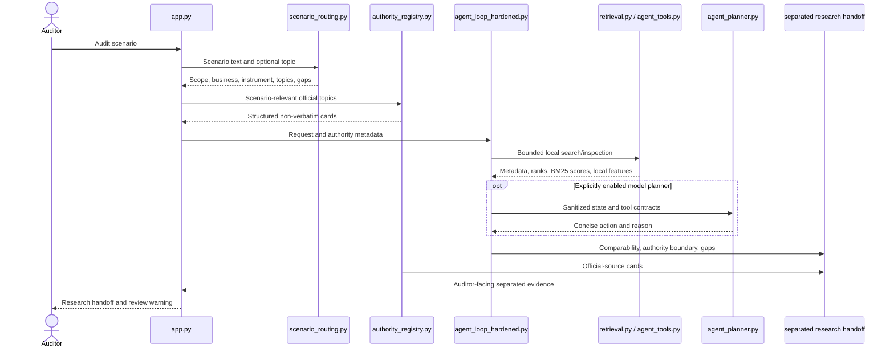

# Architecture and module map — post-hardening release

## Runtime flow

The controller owns candidate scope and tool legality. Planner output never directly mutates evidence or promotes authority. The handoff independently filters scope leakage.

## Module map

| File/module | Responsibility | Principal public surface |
| --- | --- | --- |
| `app.py` | Streamlit composition, human-readable labels, current-run status, authority/comparator handoff and historical experiment display. | `main()` plus display helpers. |
| `src/schemas.py` | Validated immutable data models for candidates, evidence chunks, guidance, evidence cards and research requests. | `Candidate`, `EvidenceChunk`, `GuidanceLink`, `EvidenceCard`, `ResearchRequest`. |
| `src/source_registry.py` | JSON registry/corpus loading, uniqueness validation, raw and canonical hashing, read-only private loading. | `load_candidates`, `load_corpus`, `load_private_corpus_read_only`, hash helpers. |
| `src/private_runtime.py` | Audits the optional private bundle and loads historical baseline metrics. | `audit_private_bundle`, `load_private_baseline`. |
| `src/scenario_routing.py` | Conservative scope, business and instrument classification independent of issuer names and evaluation labels; authority-gap detection. | `route_scenario`, `authority_coverage`. |
| `src/authority_registry.py` | Loads and validates the seven-card official authority registry, identifies topics, creates planner-safe cards and builds separated handoffs. | `IFRSAuthorityCard`, `retrieve_authority_cards`, `build_separated_research_handoff`. |
| `src/retrieval.py` | Dependency-free tokenization and BM25 search over local evidence. | `BM25Index`, `RetrievalHit`, `search_candidates`. |
| `src/agent_tools.py` | Read-only local research tools, source metadata shaping, local feature extraction and scenario-aware comparability. | `LocalResearchTools`, `extract_local_features`. |
| `src/agent_planner.py` | Deterministic planner, OpenRouter-compatible planner, response validation and outbound privacy assertions. | `DeterministicFallbackPlanner`, `OpenRouterPlanner`, `assert_safe_planner_payload`. |
| `src/agent_loop_hardened.py` | Current bounded state machine: legal transitions, step/duplicate controls, controller-owned candidate scope, authority and comparability requirements, traces and safe stopping. | `BoundedAgentController`, `run_bounded_agent`, `AgentResearchResult`. |
| `src/guardrails.py` | Claim/source validation and authority-boundary enforcement. | `validate_claim_source_ids`, `GuardrailViolation`. |
| `src/evidence_cards.py` | Outbound-card gate and local draft abstention; only approved self-authored cards can be sent. | `build_outbound_payload`, `send_approved_cards`, `draft_local_note`. |
| `src/trace_log.py` | Sanitized trace entries and JSON-safe export. | `TraceEntry`, `TraceLog`. |
| `src/external_discovery.py` | Bounded SEC metadata/filing client, local body processing, framework evidence parsing, feature derivation and Gate 5 state machine. | `SecEdgarClient`, `ExternalDiscoveryTools`, `Gate5Controller`, `run_gate5_discovery`. |
| `src/external_discovery_ifrs.py` | Gate 5.1 IFRS constraint, SIC/business filtering, early US-GAAP rejection and compact planner state. | `Gate51Tools`, `Gate51Controller`, `run_gate51_discovery`. |
| `src/final_submission.py` | Reads the sanitized recorded flagship snapshot for display; does not rerun discovery. | `load_final_submission_snapshot`, `candidate_by_company`. |
| `src/release_audit.py` | Scans the release-eligible tree for private material/secrets and verifies historical/private integrity. | `public_files`, `run_release_audit`. |
| `src/agent_loop.py` | Earlier Gate 4 bounded loop retained for historical tests and trace reproducibility. | Legacy `BoundedAgentController`, `run_bounded_agent`. |
| `src/research_agent.py` | Earlier deterministic research workflow retained for historical prototype tests. | `ToolController`, `run_offline_workflow`. |

## Operational and evaluation scripts

| File | Purpose |
| --- | --- |
| `gate45_live_validation.py` | Preserved three-case live-planner validation that exposed the original loop failures. |
| `gate46_live_validation.py` | Explicit-state-machine live validation; reads the OpenRouter key only from the environment. |
| `gate5_live_validation.py` | Single bounded SEC discovery validation with local filing handling. |
| `gate51_live_validation.py` | Single IFRS-targeted SEC/model validation; not rerun after the documented post-live hardening. |
| `evaluations/auditor_scenario_v1*/run_deterministic.py` | Original frozen offline scenario replays; their strict manifests describe the historical source snapshot. |
| `evaluations/scenario_hardening_postfix_v1/run_postfix_offline.py` | Creates the separate S01–S08 post-fix diagnostic observations without live calls. |
| `evaluations/scenario_hardening_postfix_v1/run_all_tests_offline.py` | Raw unfiltered offline suite, including visible historical snapshot errors. |
| `evaluations/post_hardening_release_v1/run_release_verification.py` | Current release gate that runs current tests and unchanged historical checks in explicit categories. |

## Data and evidence boundaries

| Boundary | Allowed | Prohibited |
| --- | --- | --- |
| Local retrieval | Raw private chunks in process; local previews; chunk/page provenance. | Publishing or packaging corpus text. |
| Planner payload | Scenario, tool contracts, structured state, source identifiers, ranks/scores, authority metadata and non-verbatim local features. | Raw annual-report, filing or IFRS source text; secrets; local filesystem paths. |
| Public-safe trace | Tool names, concise action/reason summaries, metadata, hashes, URLs/accessions, decisions and usage/cost. | Hidden chain-of-thought, raw report bodies, credentials. |
| Authority handoff | Verified paragraph references where available, non-verbatim summaries and official IFRS Foundation URLs. | Bulk IFRS text or treating educational/IFRIC material as Standard text. |
| Company-practice handoff | Reviewed evidence-derived summaries and provenance. | Inferring IFRS requirements from issuer disclosure. |

## Control limits

- Local workflow: six steps maximum.
- External workflow: ten steps maximum, three candidates inspected per scenario, at most two filings per accepted candidate.
- Duplicate tool and external requests are blocked.
- Network errors stop safely.
- Framework remains pending without issuer-specific evidence; Form 20-F alone never proves IFRS.
- Out-of-scope or mixed scenarios stop/request clarification before retrieval leakage.

## Tests by concern

- `tests/test_scenario_hardening_postfix.py`: routing, authority gaps, comparability, handoff scope defence and privacy.
- `tests/test_streamlit_app.py`: Streamlit rendering and auditor-facing handoff regression.
- `tests/test_gate61_authority_layer.py`: authority classification, paragraph/reference integrity and planner boundary.
- `tests/test_gate46_state_machine.py`: legal transitions and controller-owned scope.
- `tests/test_gate5_external_discovery.py` and `tests/test_gate51_ifrs_discovery.py`: bounded discovery with mocked networking.
- `tests/test_post_hardening_release_integrity.py`: current release manifest, 88 protected artifacts, frozen observations and legacy-validator semantics.

The version-aware runner executes all current tests and the four unchanged historical snapshot checks in separate named categories.
